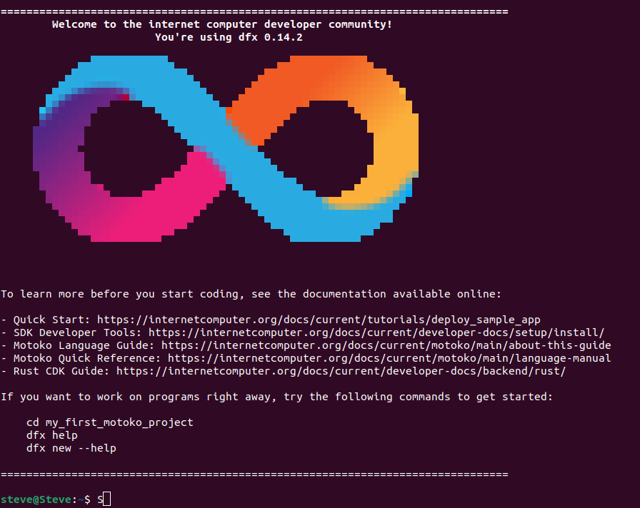

# MOTOKO LANGUAGE COURSE
This is a guide that will help you start developing decentralized applications on Internet Computer using the Motoko Language 

The guide is divided into different sections: 
1. Setting up your environment for deploying applications on the Internet Computer 
2. Brief overview of Motoko Language 
3. Building your first Motoko dApp 
4. Resources

## Environment Setup 
Follow this [guide](https://docs.google.com/document/d/1OW3oT8F9pumYg3hmybrHFB8T0VpDwDgRVE5PfVkHFJI/edit?usp=sharing) to help you set up your environment on Windows, Linux or Mac Machines 

## Overview of motoko language
Motoko is the current programming language on Internet Computer that is being developed and maintained by Dfinity Foundation (Parent company of Internet Computer)

It is mainly used to build distributed applications that run on the Internet Computer blockchain network 

A canister smart contract (canister in short) is normally represented using an ``actor`` in Motoko Programming Language 

```
actor {

    //actor code goes here

}
```

This is the format of defining a function in Motoko: 
```
actor {

    // Function Definition 
    public func myName(name: Text) : async Text {
        return "Hello , " # name; 
    }

}
```
Here's a breakdown of the code: 
   * ``public func myName(name: Text)`` This line declares a public function named ``myName``. The function takes one argument ``name`` of type ``Text`` 

   * ``: async Text {`` This part indicates that this function returns a Text value asynchronously. The ``async`` keyword is used to denote that a function is asynchronous, meaning it can perform operations that might take some time to complete, and it won't block the execution of other code while it's waiting for these operations to finish. Those that have a background in Javascript will understand this better.  

   * ``return "Hello , " # name;`` This line is the body of the function. It returns a ``Text`` value that is a concatenation of the string ``"Hello , "`` and the name argument. The ``#`` operator is used in Motoko to concatenate strings.

   * ``}`` This line closes the function definition

So, when you call this function with a Text argument, it will return a greeting message that includes the name you provided. For example, if you call ``myName("Alice")``, it will return ``"Hello , Alice"``.

## Building your first Motoko dApp 
The first step is to ensure you have all dependencies deployed. i.e 
* Node 18^ 
* dfx 
* Rust 

If not check out this [guide](https://docs.google.com/document/d/1OW3oT8F9pumYg3hmybrHFB8T0VpDwDgRVE5PfVkHFJI/edit?usp=sharing) 

### Steps 
Open your terminal and run the command: 
    ``dfx new my_first_motoko_project``. By default ``dfx new`` creates a new project in the Motoko language 

Once it's succesfull this is what you'll see: 



You can now run the command ``cd my_first_motoko_project`` to enter the directory and ``code -r .`` to open the project in VS Code 

This is the project's file structure: 
```
my_first_motoko_project        # The root of the project
├── README.md
├── dfx.json                   # The configuration file for your Internet Computer dapp
├── package-lock.json          # Node.js package configuration
├── package.json               # Node.js package configuration
├── src
│   ├── my_first_motoko_project_backend           # Folder containing the source code of your dapp's backend.
│   │   └── main.mo                               # The default source code file; this is what you'll primarily be working with.
│   └── my_first_motoko_project_frontend          # Folder containing the frontend configuration and assets of your dapp. 
│       └── ...
└── webpack.config.js                             # Web dapp bundler configuration.
```

Your main focus will be tailored on the ``src`` directory which contains: 
  * ``src/my_first_motoko_project_backend`` contains the files that serve as the backend of the dapp
  * ``src/my_first_motoko_project_frontend`` contains the files that serve as the frontend of the dapp

##### Note: If you'd like to create a project without a frontend canister, the ``--no-frontend`` flag can be used with the ``dfx new`` command.

On you backend folder you'll see the ``main.mo`` file which contains the main Motoko code you'll be working with. I won't explain this since we already did a brief introduction to the Motoko syntax at the begining of this tutorial. [Here]()

Connecting your frontend to the backend is very easy. Go to the ``src`` folder inside the ``my_first_motoko_project_frontend`` folder. 

```
 my_first_motoko_project_frontend
   └── ...  
   └── src 
        ├── ... 
        ├── index.html 
        ├── index.js

```
Inside our ``index.js`` file is a Javascript code that calls the ``greet`` function inside the ``main.mo`` file in the backend folder. 

Here's a breakdown of what it does:
* ``import { my_first_motoko_project_backend } from "../../declarations/my_first_motoko_project_backend";`` This line imports the actor (canister) interface from the declarations directory. This interface allows the JavaScript code to interact with the Motoko actor.

* ``document.querySelector("form").addEventListener("submit", async (e) => {...});`` This line adds an event listener to the form element in your ``index.html``. When the form is submitted, it triggers the function defined in the event listener.

* ``e.preventDefault();`` This line prevents the default form submission behavior, which is to refresh the page.

* ``const button = e.target.querySelector("button");`` This line selects the button element from the form that was submitted.

* ``const name = document.getElementById("name").value.toString();`` This line gets the value of the HTML element with the id "name" and converts it to a string

* ``button.setAttribute("disabled", true);`` This line disables the button to prevent multiple submissions 

* ``const greeting = await my_first_motoko_project_backend.greet(name);`` This line sends a request to the Motoko actor (canister) to execute the ``greet`` function with the ``name`` as an argument. The ``await`` keyword is used because this is an asynchronous operation.

* ``button.removeAttribute("disabled");`` This line re-enables the button after the response from the greet function is received.

* ``document.getElementById("greeting").innerText = greeting;`` This line sets the text of the HTML element with the id "greeting" to the response received from the greet function.

* ``return false;`` This line ends the function and prevents the form from being submitted in the traditional way.

This code is a typical example of how a front-end JavaScript application can interact with a Motoko actor (canister) on the Internet Computer

#### Deploying the dApp locally
Follow these commands to deploy the dApp locally: 

``dfx start --background``: this command starts the local canister execution environment for the current project

``dfx deploy``: this command deploys all canisters from the project's source code.

If you'd like to only deploy the backend canister code you can run the command: 
``dfx deploy my_first_motoko_project_backend``

Learn more about dfx [here](https://internetcomputer.org/docs/current/tutorials/developer-journey/level-0/intro-dfx)

The output of the ``dfx deploy`` command if run succesfully will show: 

```
URLs:
  Frontend canister via browser
    my_first_motoko_project_frontend: http://127.0.0.1:4943/?canisterId=bd3sg-teaaa-aaaaa-qaaba-cai
  Backend canister via Candid interface:
    my_first_motoko_project_backend: http://127.0.0.1:4943/?canisterId=be2us-64aaa-aaaaa-qaabq-cai&id=bkyz2-fmaaa-aaaaa-qaaaq-cai
```

#### Deploying your dApp to the Internet Computer Network 
In progress... 

#### Resources
* [Motoko Documentation](https://internetcomputer.org/docs/current/motoko/main/motoko)
* [dfx documentation](https://internetcomputer.org/docs/current/tutorials/developer-journey/level-0/intro-dfx)


